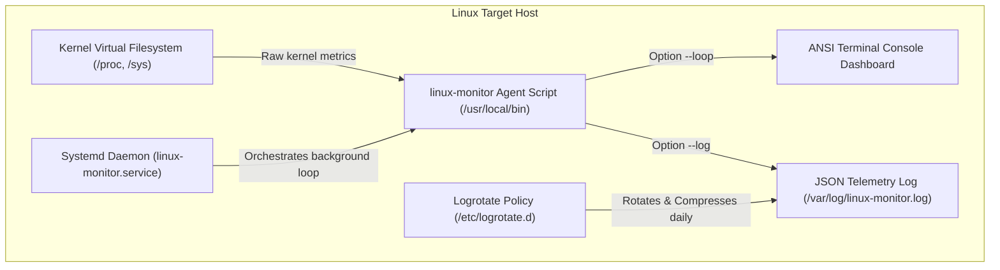

# SRE Native Linux Monitoring Agent (Bash)

[](https://www.kernel.org/)
[](https://systemd.io/)
[](LICENSE)

A production-grade, zero-dependency **Native Linux Observability Agent** written entirely in pure Bash. It collects host hardware metrics (CPU, RAM, Disk, Load, Network, Processes) directly by parsing the kernel's `/proc` virtual filesystem, and installs as a background daemon (systemd service) with automated log rotation.

---

## 💼 Business Case & Problem Statement

### The Problem
Deploying heavy third-party monitoring agents (like Node Exporter, Datadog, or Telegraf) on high-density production Linux servers introduces operational issues:
- **Resource Overhead**: Telemetry containers/agents eat CPU cycles and RAM that should be reserved for application workloads.
- **Dependency Bloat**: Managing packaging dependencies, runtime engines (like Docker), or security patches for agents creates setup friction.
- **Infinite Logs**: Agents writing logs to text files will eventually exhaust disk space if log rotation is not explicitly configured.

### The Solution
This project deploys a lightweight, zero-dependency monitoring script:
- **No External Agents**: Directly parses kernel `/proc` metrics (consuming < 1% CPU and < 2MB RAM).
- **Systemd Daemon Integration**: Runs as a standard background system daemon (`linux-monitor.service`) to collect JSON telemetry.
- **Safe Log Rotation**: Sets up automated policies (`logrotate`) to rotate metrics history, ensuring the host never runs out of disk space.

---

## 🏗️ Technical Architecture & Telemetry Flow



---

## 📁 Repository Structure

```text
.
├── architecture_diagram.png        # Telemetry pipeline architecture diagram
├── README.md                       # Core documentation
├── LICENSE                         # MIT License
└── scripts/
    ├── monitor.sh                  # Custom Bash agent parsing /proc statistics
    └── deploy.sh                   # Systemd service and logrotate installer script
```

---

## 🚀 Installation & Service Deployment (Ubuntu/Debian)

Run the deployment script with `sudo` to register the script as a daemon and configure logs:

```bash
# Clone the repository and navigate inside
cd /opt/linux-sre

# Make scripts executable
chmod +x scripts/*.sh

# Run the installer as root
sudo ./scripts/deploy.sh
```

---

## 🔧 Script Command-Line Options

You can execute the agent manually (`/usr/local/bin/linux-monitor`) with the following flags:

*   `--loop`: Runs in a loop, updating a colorful console dashboard every 3 seconds (ideal for live diagnostics).
*   `--once`: Collects metrics once and prints them in a structured dashboard layout.
*   `--json`: Outputs current metrics in structured JSON format to stdout.
*   `--log <file>`: Appends a structured JSON metrics entry to the target file.

---

## 🔍 Verification & SRE Telemetry Checks

1. **Verify Background Service**:
   Check if the systemd monitoring service is successfully running:
   ```bash
   systemctl status linux-monitor
   ```

2. **Verify JSON Metrics Log**:
   Check the output log where the daemon records performance statistics:
   ```bash
   tail -f /var/log/linux-monitor.log
   ```
   *Expected Output Format:*
   ```json
   {
     "timestamp": "2026-07-19T12:00:00Z",
     "hostname": "ubuntu-server",
     "uptime": "2d 4h 12m",
     "metrics": {
       "cpu_usage_percent": 12.45,
       "load_average": { "1m": 0.15, "5m": 0.22, "15m": 0.10 },
       "process_count": 142,
       "memory": { "total_mb": 4096, "used_mb": 1204, "usage_percent": 29.39 },
       "disk": { "total_gb": 40.2, "used_gb": 12.4, "usage_percent": 30.84 }
     }
   }
   ```

3. **Verify Log Rotation Policy**:
   Test if logrotate parses our configuration without errors:
   ```bash
   sudo logrotate -d /etc/logrotate.d/linux-monitor
   ```

---

## 📊 Kernel Metrics Parsing Reference

This script reads raw kernel states directly from files:
- **CPU**: `/proc/stat` (Calculates active CPU cycles over 1 second).
- **RAM**: `/proc/meminfo` (Parses `MemTotal`, `MemFree`, and `MemAvailable`).
- **Load Averages**: `/proc/loadavg` (Reads kernel scheduler queues).
- **Uptime**: `/proc/uptime` (Converts system boot seconds to printable durations).
- **Processes**: `/proc/[0-9]*` (Counts numerical PIDs inside the process mount).
- **Network**: `/proc/net/dev` (Tracks primary device packet rates).
