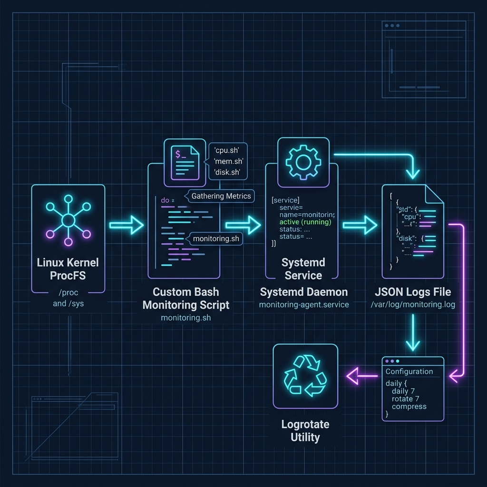

# Linux Monitoring & Telemetry Platform (SRE Portfolio)

[](https://docs.docker.com/)
[](https://prometheus.io/)
[](https://grafana.com/)

A production-ready Linux Monitoring Platform built with **Docker Compose**, **Prometheus**, **Node Exporter**, and **Grafana** to collect, store, and visualize host telemetry in real-time.

---

## 💼 Business Case & Problem Statement

### The Problem
Modern enterprise systems suffer from sudden outages, high **MTTR (Mean Time to Resolution)**, and bloated cloud budgets due to zero infrastructure visibility:
- **Silent Resource Exhaustion**: CPU, RAM, or Disk runs out quietly, causing business-critical services to crash.
- **Manual Troubleshooting**: Operations teams waste time logging into individual servers via SSH to run CLI diagnostics (`top`, `df`).
- **No Capacity Planning**: Lack of historic telemetry leads to server over-provisioning (wasted budget) or under-provisioning.

### The Solution
This platform automates infrastructure observability to improve reliability and reduce downtime:
- **Proactive Alerts**: Evaluates thresholds and triggers warnings (e.g. predicting disk exhaustion 24 hours in advance using PromQL).
- **Centralized Telemetry**: Correlates all system performance metrics into a single, dynamic Grafana dashboard.
- **Zero Configuration Drift**: Standardized as Infrastructure-as-Code via Docker Compose for deterministic, click-free deployments.

---

## 🏗️ Architecture & Data Flow



*Data Flow: Linux Host Kernel -> Node Exporter (HTTP Pull) -> Prometheus TSDB -> Grafana UI Dashboard.*

---

## 📁 Repository Structure

```text
.
├── docker-compose.yml              # Container stack orchestration definition
├── architecture_diagram.png        # Telemetry pipeline architecture diagram
├── README.md                       # Core documentation
├── prometheus/
│   ├── prometheus.yml              # Prometheus scraping configuration
│   └── alerts.yml                  # Alerting rules (CPU, Memory, Disk, Net)
├── grafana/
│   ├── provisioning/               # Auto-import configurations
│   │   ├── datasources/datasource.yml
│   │   └── dashboards/dashboard.yml
│   └── dashboards/
│       └── linux_dashboard.json    # Complete 9-panel Grafana dashboard
└── scripts/
    └── deploy.sh                   # Ubuntu auto-installer and launch script
```

---

## 🚀 Deployment Guide (Ubuntu/Debian)

### Run Deployment Script
On Ubuntu or Debian, the deployment script automatically installs Docker, Docker Compose, curl, and stress tools if they are missing, validates config files, and launches the stack:

```bash
# Clone the repository and navigate inside
cd /opt/linux-sre

# Make script executable
chmod +x scripts/deploy.sh

# Run with sudo to enable auto-installation of Docker if missing
sudo ./scripts/deploy.sh
```

*Note: For other OS targets, pre-install Docker and Docker Compose v2, then run `./scripts/deploy.sh`.*

---

## 🔍 Verification & Testing

1. **Verify Prometheus Targets**: Go to `http://<server-ip>:9090/targets` to verify both `prometheus` and `node-exporter` show as `UP`.
2. **Access Grafana Dashboard**: Go to `http://<server-ip>:3000` (User: `admin` / Password: `admin`) and open the **Linux SRE Performance & Telemetry Dashboard**.
3. **Simulate Alerting Load**: Run a stress test on your host server to verify warning thresholds trigger:
   ```bash
   sudo apt install -y stress
   stress --cpu 4 --timeout 300
   ```

---

## 📊 PromQL Cheat Sheet (SRE Golden Signals)

Primary metrics formulas used inside our dashboard configurations:

- **CPU Utilization %**:
  `100 - (avg by (instance) (rate(node_cpu_seconds_total{mode="idle"}[2m])) * 100)`
- **Available RAM %**:
  `(node_memory_MemTotal_bytes - node_memory_MemAvailable_bytes) / node_memory_MemTotal_bytes * 100`
- **Root Disk Space Usage %**:
  `100 - (node_filesystem_avail_bytes{mountpoint="/"}/node_filesystem_size_bytes{mountpoint="/"}) * 100`
- **Network Traffic (Bytes/sec)**:
  `rate(node_network_receive_bytes_total{device!~"lo|docker.*|veth.*"}[2m])`
- **Disk Write Latency (ms)**:
  `rate(node_disk_write_time_seconds_total[5m]) / rate(node_disk_writes_completed_total[5m]) * 1000`
